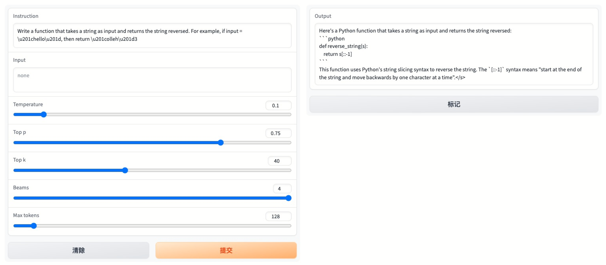

# OpenLLaMA-Chinese

 <div align=center></div>

 <div align=center>
 
 
 
 </div>

**OpenLLaMA-Chinese** is a 100% free Chinese large language model, and can be utilized for both **non-commercial and commercial purposes**.

OpenLLaMA-Chinese is built on [OpenLLaMA](https://github.com/openlm-research/open_llama), which is a permissively licensed open-source reproduction of Meta AI's LLaMA 7B and 13B models, trained on the RedPajama dataset. OpenLLaMA also includes a smaller 3B variant of the LLaMA model. We have conducted fine-tuning on Chinese and English instructions using the OpenLLaMA base models and have made our weights publicly available.

### News  
\[2023/06/29\] We released the [openllama 13b](https://huggingface.co/FittenTech/openllama-english-13b-evol-instruct) model by using [evol intructions](https://huggingface.co/datasets/WizardLM/WizardLM_evol_instruct_V2_196k).

\[2023/06/24\] We use [evol intructions](https://huggingface.co/datasets/WizardLM/WizardLM_evol_instruct_V2_196k) from [WizardLM](https://github.com/nlpxucan/WizardLM) to finetune the [openllama 7B](https://huggingface.co/FittenTech/openllama-english-7b-evol-intruct), the 13B Model will be avaliable in next week!.

### Evol Instruction Examples




#### Evol Instructions Fine-tuning Weights:

- [OpenLLaMA 7B Evol Intruct](https://huggingface.co/FittenTech/openllama-english-7b-evol-intruct)
- [OpenLLaMA 13B Evol Intruct](https://huggingface.co/FittenTech/openllama-english-13b-evol-instruct)

#### Chinese Instructions Fine-tuning Weights:

- [OpenLLaMA 3B](https://huggingface.co/FittenTech/openllama-chinese-3b)
- [OpenLLaMA 7B](https://huggingface.co/FittenTech/openllama-chinese-7b)
- [OpenLLaMA 13B](https://huggingface.co/FittenTech/openllama-chinese-13b)

#### English Instructions Fine-tuning Weights:
- [OpenLLaMA 3B](https://huggingface.co/FittenTech/openllama-english-3b)
- [OpenLLaMA 7B](https://huggingface.co/FittenTech/openllama-english-7b)
- [OpenLLaMA 13B](https://huggingface.co/FittenTech/openllama-english-13b)

#### Chinese+English Instructions Fine-tuning Weights:
- [OpenLLaMA 3B](https://huggingface.co/FittenTech/openllama-chinese-english-3b)
- [OpenLLaMA 7B](https://huggingface.co/FittenTech/openllama-chinese-english-7b)
- [OpenLLaMA 13B](https://huggingface.co/FittenTech/openllama-chinese-english-13b)

## Data

For Chinese fine-tuning, we utilized the [alpaca_data_zh_51k.json](data/alpaca_data_zh_51k.json) from the [Chinese-LLaMA-Alpaca](https://github.com/ymcui/Chinese-LLaMA-Alpaca) project.

For English fine-tuning, we employed the [alpaca_data.json](data/alpaca_data.json) from the [StanfordAlpaca](https://github.com/tatsu-lab/stanford_alpaca) project.

For fine-tuning with both English and Chinese instructions, we used data from both sources.

## Usage
We modified the generate code from [LLaMA-X](https://github.com/AetherCortex/Llama-X).

To use the PyTorch inference code, follow these steps:

1. Download the weights and update the base_model path in inference/gen_torch.py.
2. Run the following command:
```shell
python inference/gen_torch.py
```

## Pretraining and Finetuning
FittenTech offers LLMs pretraining and fine-tuning services. For more details, please visit https://llm.fittentech.com/.

## Acknowledgments
We would like to express our gratitude to the developers of the following open-source projects, as our project builds upon their work:

- [LLaMA](https://github.com/facebookresearch/llama)
- [OpenLLaMA](https://github.com/openlm-research/open_llama)
- [Jittor](https://github.com/Jittor/jittor)
- [JittorLLMs](https://github.com/Jittor/JittorLLMs)
- [LLaMA-X](https://github.com/AetherCortex/Llama-X)
- [Chinese-LLaMA-Alpaca](https://github.com/ymcui/Chinese-LLaMA-Alpaca)
- [StanfordAlpaca](https://github.com/tatsu-lab/stanford_alpaca)
- [transformers](https://github.com/huggingface/transformers)
- [WizardLM](https://github.com/nlpxucan/WizardLM)

## License
We adopt the Apache License, following OpenLLaMA's license.
